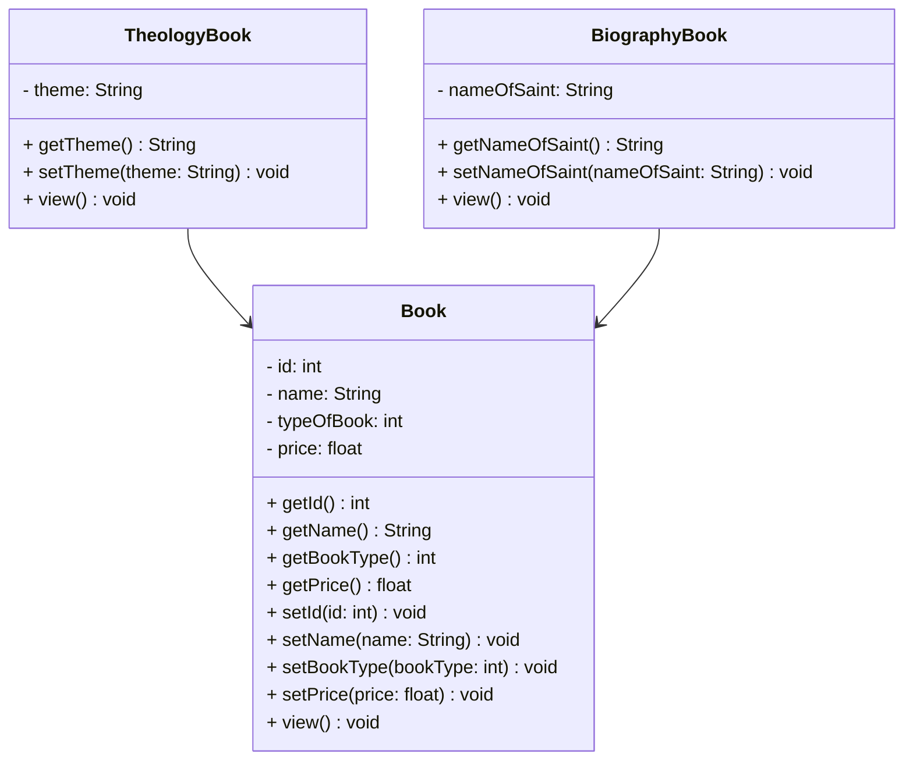

# Projeto Final Bloco 01 (e-commerce) - Java

<br />

<div align="center">
	
</div>
<br />

<div align="center">
  
  
  
  
  
  
  

</div>


------

<br />

## 1. Descrição

O **Projeto Final Bloco 01** foi desenvolvido durante o bootcamp da **Generation Brasil** com o objetivo de aplicar na prática os conceitos de **Programação Orientada a Objetos (POO)** com **Java**.

Neste projeto, foi criado um sistema CRUD para a **Livraria Dom Bosco**, uma loja virtual fictícia especializada em livros religiosos, com foco nas categorias **Teologia** e **Biografias de Santos**. O sistema permite:

-   📥 Cadastro de livros
    
-   🔍 Consulta por ID e listagem completa
    
-   ✏️ Atualização de informações
    
-   🗑️ Remoção de livros
    

O projeto organiza os dados dos livros — como nome, tipo, preço e detalhes específicos — para oferecer um modelo funcional de gestão de produtos, promovendo controle, agilidade e boa prática de codificação.

#### 💡 Conceitos de POO aplicados:

-   Classes e Objetos
    
-   Atributos e Métodos
    
-   Modificadores de Acesso
    
-   Herança e Polimorfismo
    
-   Classes Abstratas
    
-   Interfaces
    

Este projeto representa uma base sólida de aprendizado para a construção de sistemas orientados a objetos e prepara o desenvolvedor para desafios mais avançados no mundo do desenvolvimento Java.
<br />

## 2. Funcionalidades do Projeto

1. **Cadastrar Livro:** -   Adiciona um novo livro ao sistema especificando nome, preço, categoria e outras propriedades relevantes. O identificador do livro é gerado automaticamente.
2. **Listar todos os Livros:** Exibe todos os livros cadastrados no sistema com informações detalhadas.
3. **Consultar Livro por ID:** Localiza um livro específico a partir do seu identificador único.
4. **Editar Livro:** Permite atualizar os dados de um livro existente com base no seu ID.
5. **Excluir Livro:** Remove um livro específico do sistema a partir do seu ID.

<br />

## 3. Diagrama de Classes

<br />

Um **Diagrama de Classes** é um modelo visual usado na programação orientada a objetos para representar a estrutura de um sistema. Ele exibe classes, atributos, métodos e os relacionamentos entre elas, como associações, heranças e dependências.

Esse diagrama ajuda a planejar e entender a arquitetura do sistema, mostrando como os componentes interagem e se conectam. É amplamente utilizado nas fases de design e documentação de projetos.

Abaixo, você confere o Diagrama de Classes do Projeto Farmácia (e-commerce):



<br />

## 4. Tela Inicial do Sistema - Menu

<br />

<div align="center">
   
</div>


<br />

## 5. Requisitos

<br />

Para executar os códigos localmente, você precisará de:

- [Java JDK 17+](https://www.oracle.com/java/technologies/javase/jdk17-archive-downloads.html)
- [Eclipse](https://eclipseide.org/) ou [STS](https://spring.io/tools)

<br />

## 6. Como Executar o projeto no Eclipse/STS

<br />

### 6.1. Importando o Projeto

1. Clone o repositório do Projeto [projeto_final_bloco_01](https://github.com/Brunogodoy2911/projeto_final_bloco_01) dentro da pasta do *Workspace* do Eclipse/STS

```bash
git clone https://github.com/Brunogodoy2911/projeto_final_bloco_01
```

2. **Abra o Eclipse/STS** e selecione a pasta do *Workspace* onde você clonou o repositório do projeto
3. No menu superior do Eclipse/STS, clique na opção: **File 🡲 Import...**
4. Na janela **Import**, selecione a opção: **General 🡲 Existing Projects into Workspace** e clique no botão **Next**
5. Na janela **Import Projects**, no item **Select root directory**, clique no botão **Browse...** e selecione a pasta do Workspace onde você clonou o repositório do projeto
6. O Eclipse/STS reconhecerá automaticamente o projeto
7. Marque o Projeto Conta Bancária no item **Projects** e clique no botão **Finish** para concluir a importação

<br />

### 6.2. Executando o projeto

1. Na guia **Package Explorer**, localize o Projeto Conta Bancária
2. Abra a **Classe Menu**
3. Clique no botão **Run**  para executar a aplicação
4. Caso seja perguntado qual é o tipo do projeto, selecione a opção **Java Application**
5. O console exibirá o menu do Projeto.

<br />

## 7. Contribuição

<br />

Este repositório é parte de um projeto educacional, mas contribuições são sempre bem-vindas! Caso tenha sugestões, correções ou melhorias, fique à vontade para:

- Criar uma **issue**
- Enviar um **pull request**
- Compartilhar com colegas que estejam aprendendo Java!

<br />

##  8. Contato

<br />

Desenvolvido por [**Bruno Godoy**](https://github.com/Brunogodoy2911)
Para dúvidas, sugestões ou colaborações, entre em contato via GitHub ou abra uma issue!
